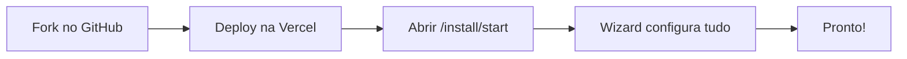

# SmartZap

> Automação de WhatsApp com IA integrada. Dispare campanhas, converse com clientes e deixe agentes de IA atenderem por você.

---

## Índice

- [Sobre](#-sobre)
- [O que você pode fazer](#-o-que-você-pode-fazer)
- [Instalação Rápida](#-instalação-rápida)
- [Primeiros Passos](#-primeiros-passos)
- [Como Usar](#-como-usar)
- [Configurações](#%EF%B8%8F-configurações)
- [Problemas Comuns](#-problemas-comuns)
- [Suporte](#-suporte)

---

## Sobre

**SmartZap** é uma plataforma completa de automação de WhatsApp que ajuda você a se comunicar com clientes de forma mais inteligente e produtiva.

### Por que escolher SmartZap?

- **Instalação em minutos**: Deploy na Vercel + wizard que configura tudo
- **Campanhas em massa**: Dispare mensagens para milhares de contatos com templates aprovados
- **Inbox em tempo real**: Converse com clientes direto do navegador
- **Agentes de IA**: Deixe a IA responder automaticamente com contexto personalizado
- **Memória de conversas**: A IA lembra do histórico de cada cliente
- **Funciona em qualquer lugar**: Instale como app (PWA) e receba notificações

---

## O que você pode fazer

### Campanhas de WhatsApp

- Dispare mensagens para toda sua base de contatos
- Use templates aprovados pela Meta (marketing, utilidade, autenticação)
- Acompanhe métricas em tempo real (enviados, entregues, lidos)
- Pré-validação antes do disparo para evitar erros
- Reenvio automático para contatos que falharam

### Inbox (Chat em tempo real)

- Receba mensagens de clientes direto no navegador
- Responda manualmente ou deixe a IA atender
- Veja histórico completo de cada conversa
- Notificações push quando chegam mensagens

### Agentes de IA

- Configure agentes com personalidade e instruções
- A IA responde automaticamente às mensagens
- Memória persistente: a IA lembra do contexto de cada cliente
- Logs completos de todas as interações

### Gestão de Contatos

- Importe contatos via CSV
- Campos personalizados para segmentação
- Status de opt-in/opt-out automático
- Validação de números no formato internacional

### Templates do WhatsApp

- Sincronize templates aprovados da sua conta Meta
- Visualize preview antes de usar
- Crie novos templates direto da plataforma

### Lead Forms

- Crie formulários de captura embeddáveis
- Receba leads automaticamente na plataforma

---

## Instalação Rápida

> **Tempo estimado**: 15-20 minutos
>
> **Método recomendado**: Fork → Vercel → Wizard

Este guia vai te levar do zero até ter o SmartZap funcionando.

### O que você vai fazer

1. Fazer fork do repositório no GitHub
2. Fazer deploy na Vercel
3. Rodar o wizard de instalação
4. Começar a usar!



---

### Pré-requisitos

Antes de começar, você precisa de contas nestes serviços:

| Serviço | Para quê | Link |
|---------|----------|------|
| **GitHub** | Código do projeto | [github.com](https://github.com/) |
| **Vercel** | Hospedagem | [vercel.com](https://vercel.com/) |
| **Supabase** | Banco de dados | [supabase.com](https://supabase.com/) |
| **Meta Business** | API do WhatsApp | [business.facebook.com](https://business.facebook.com/) |
| **Upstash** | Fila de mensagens | [upstash.com](https://upstash.com/) |

> **Dica**: Crie as contas antes de começar e deixe abertas em abas diferentes.

---

### Passo 1: Fork no GitHub

1. Acesse o repositório do SmartZap
2. Clique no botão **Fork** (canto superior direito)
3. Escolha sua conta pessoal ou organização
4. Aguarde o fork ser criado

> **Pronto quando**: Você ver o repositório `smartzap` na sua conta do GitHub

---

### Passo 2: Deploy na Vercel

1. Acesse [vercel.com](https://vercel.com/) e faça login
2. Clique em **Add New Project**
3. Conecte sua conta do GitHub (se ainda não conectou)
4. Selecione **smartzap** (seu fork)
5. Clique em **Deploy**

> **Aguarde**: O deploy leva cerca de 2-3 minutos

6. Quando terminar, copie a URL do seu projeto (ex: `https://smartzap-abc123.vercel.app`)

> **Pronto quando**: Você tiver uma URL funcionando

---

### Passo 3: Rodar o Wizard de Instalação

1. **Acesse o wizard**
   - Abra: `https://SEU-PROJETO.vercel.app/install/start`

2. **Prepare suas credenciais**

   **Token da Vercel:**
   - Vá em Vercel → Settings → Tokens
   - Clique em "Create Token"
   - Copie o token (aparece só uma vez!)

   **Credenciais do Supabase:**
   - Vá em [supabase.com](https://supabase.com/) → New Project
   - Aguarde a criação (2-3 minutos)
   - Vá em Settings → API
   - Copie: Project URL, anon key, service_role key

   **Credenciais do Upstash:**
   - Vá em [upstash.com](https://upstash.com/) → Create Database
   - Copie o QSTASH_TOKEN

3. **Preencha o wizard**

   O wizard vai pedir:
   - Token da Vercel
   - URL do Supabase
   - Chaves do Supabase
   - Token do QStash
   - Senha de administrador

4. **Aguarde a instalação**

   O wizard vai:
   - Aplicar migrations no banco
   - Configurar variáveis na Vercel
   - Fazer redeploy automático

   **Tempo**: 3-5 minutos

5. **Pronto!**

   Você será redirecionado para fazer login.

> **Pronto quando**: Você conseguir fazer login!

---

## Primeiros Passos

### 1. Fazer login

Acesse o sistema e faça login com a senha que você configurou no wizard.

### 2. Configurar WhatsApp

1. Vá em **Configurações**
2. Na seção **WhatsApp**, preencha:
   - Phone Number ID
   - Business Account ID
   - Access Token
3. Configure o **Webhook** no Meta Business Suite:
   - URL: `https://seu-dominio.com/api/webhook`
   - Verify Token: o mesmo que você configurou

### 3. Sincronizar templates

1. Vá em **Templates**
2. Clique em **Sincronizar**
3. Seus templates aprovados aparecerão na lista

### 4. Importar contatos

1. Vá em **Contatos**
2. Clique em **Importar CSV**
3. Mapeie as colunas (nome, telefone, etc.)
4. Importe!

### 5. Criar sua primeira campanha

1. Vá em **Campanhas** → **Nova Campanha**
2. Escolha um template
3. Selecione os contatos
4. Rode o **Precheck** para validar
5. Dispare!

### 6. Testar o Inbox

1. Vá em **Inbox**
2. Peça para alguém enviar uma mensagem para seu número
3. A mensagem aparecerá em tempo real!

---

## Como Usar

### Navegação Principal

O SmartZap tem estas áreas principais:

- **Campanhas**: Criar e gerenciar disparos em massa
- **Contatos**: Lista de contatos e importação
- **Templates**: Templates do WhatsApp
- **Inbox**: Chat em tempo real com clientes
- **Configurações**: WhatsApp, IA, Integrações

### Disparando uma Campanha

1. Vá em **Campanhas** → **Nova Campanha**
2. Dê um nome para a campanha
3. Escolha o template que quer usar
4. Selecione os contatos (pode filtrar por tags)
5. Clique em **Precheck** para validar
6. Se tudo estiver OK, clique em **Disparar**
7. Acompanhe as métricas em tempo real

### Usando o Inbox

O Inbox mostra todas as conversas com clientes:

1. Clique em uma conversa para ver o histórico
2. Digite sua mensagem e envie
3. Ou ative o **AI Agent** para responder automaticamente

### Configurando AI Agents

Para ter respostas automáticas:

1. Vá em **Configurações → IA**
2. Configure uma chave de API (Gemini, OpenAI ou Anthropic)
3. Vá em **Agentes**
4. Crie um agente com:
   - Nome
   - Instruções (prompt do sistema)
   - Configurações de memória
5. Ative o agente

---

## Configurações

### WhatsApp

Você precisa de uma conta no Meta Business Suite com acesso à Cloud API.

**O que configurar:**
- **Phone Number ID**: ID do número de telefone
- **Business Account ID**: ID da conta business
- **Access Token**: Token de acesso (permanente recomendado)
- **Verify Token**: Token para verificação do webhook

### Inteligência Artificial

Para usar AI Agents, configure uma chave de API:

| Provedor | Onde conseguir |
|----------|----------------|
| **Google Gemini** | [Google AI Studio](https://makersuite.google.com/app/apikey) |
| **OpenAI** | [platform.openai.com](https://platform.openai.com/api-keys) |
| **Anthropic** | [console.anthropic.com](https://console.anthropic.com/) |

Depois:
1. Vá em **Configurações → IA**
2. Cole a chave de API
3. Escolha o modelo
4. Salve

### Upstash QStash

O QStash é usado para processar campanhas em lote.

1. Vá em [upstash.com](https://upstash.com/)
2. Crie um QStash
3. Copie o token
4. Configure em **Configurações** ou no wizard

---

## Problemas Comuns

### Não consigo fazer login

**Possíveis causas:**
- Senha incorreta
- Wizard não foi completado

**Solução:**
- Verifique se completou a instalação via wizard
- Confirme a senha que você configurou

### Mensagens não estão sendo enviadas

**Possíveis causas:**
- Credenciais do WhatsApp incorretas
- Token expirado
- Template não aprovado

**Solução:**
1. Verifique as credenciais em **Configurações**
2. Confirme que o template está aprovado no Meta
3. Veja os logs da campanha para erros específicos

### Webhook não recebe mensagens

**Possíveis causas:**
- URL do webhook incorreta
- Verify token não confere
- Webhook não configurado no Meta

**Solução:**
1. Verifique se a URL está correta: `https://seu-dominio.com/api/webhook`
2. Confirme o verify token nas duas pontas
3. Teste com: `curl "https://seu-dominio.com/api/webhook?hub.verify_token=SEU_TOKEN&hub.challenge=test&hub.mode=subscribe"`

### AI Agent não responde

**Possíveis causas:**
- Chave de API não configurada
- Agente não está ativo
- Créditos da API esgotados

**Solução:**
1. Vá em **Configurações → IA**
2. Verifique se a chave está preenchida
3. Confirme que o agente está ativo
4. Verifique os logs do agente

### Campanha travou

**Possíveis causas:**
- Problema no QStash
- Erro no template

**Solução:**
1. Veja o status em **Campanhas**
2. Clique na campanha para ver detalhes
3. Se necessário, pause e retome

### Push notifications não funcionam

**Possíveis causas:**
- PWA não instalado
- Permissões negadas

**Solução:**
1. Instale o app como PWA (adicionar à tela inicial)
2. Aceite as permissões de notificação
3. Em iOS, precisa adicionar à tela inicial primeiro

---

## Suporte

### Documentação

- **[Guia de Configuração](docs/GUIA_CONFIGURACAO.md)**: Setup completo para produção
- **[Inbox e AI Agents](docs/inbox-ai-agents.md)**: Chat e agentes de IA
- **[Integração Mem0](docs/MEM0_INTEGRATION.md)**: Memória de conversas
- **[Changelog](docs/changelog.md)**: Histórico de alterações

### Contato

- **Problemas**: Abra uma issue no GitHub
- **Dúvidas**: Entre em contato com o mantenedor

---

## Para Desenvolvedores

> Esta seção é apenas para quem quer contribuir ou entender a arquitetura técnica.

### Stack

- **Frontend**: Next.js 16, React 19, Tailwind CSS v4, shadcn/ui
- **Backend**: Next.js API Routes
- **Banco**: Supabase (PostgreSQL + Realtime)
- **Fila**: Upstash QStash
- **IA**: Vercel AI SDK v6 + Mem0
- **WhatsApp**: Meta Cloud API v24

### Instalação Local

```bash
# 1. Clone o repositório
git clone https://github.com/SEU-USUARIO/smartzap.git
cd smartzap

# 2. Instale dependências
npm install

# 3. Configure variáveis de ambiente
cp .env.example .env.local
# Preencha as variáveis

# 4. Inicie o servidor
npm run dev
```

### Scripts Disponíveis

```bash
npm run dev              # Desenvolvimento
npm run build            # Build de produção
npm run lint             # Verificar código
npm run test             # Rodar testes
npm run test:e2e         # Testes E2E
```

### Estrutura do Projeto

```
smartzap/
├── app/                 # Rotas Next.js (App Router)
│   ├── (auth)/          # Páginas de auth (login, install)
│   ├── (dashboard)/     # Páginas do dashboard
│   └── api/             # API Routes
├── components/          # Componentes React
├── hooks/               # Hooks customizados
├── lib/                 # Bibliotecas e utilitários
├── services/            # Camada de acesso à API
└── supabase/            # Migrations do banco
```

Para mais detalhes técnicos, veja:
- [CLAUDE.md](CLAUDE.md) - Guia para desenvolvedores/IA

---

**[⬆ Voltar ao topo](#smartzap)**

Feito com ❤️ para comunicação mais inteligente
